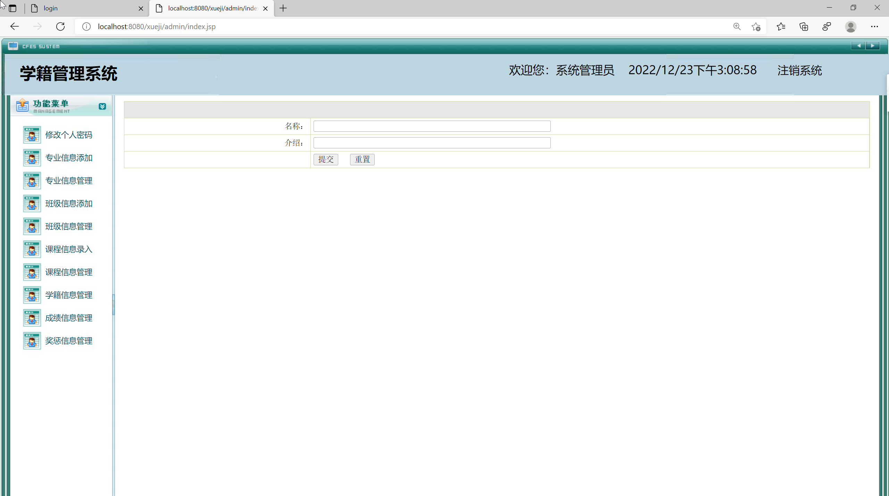
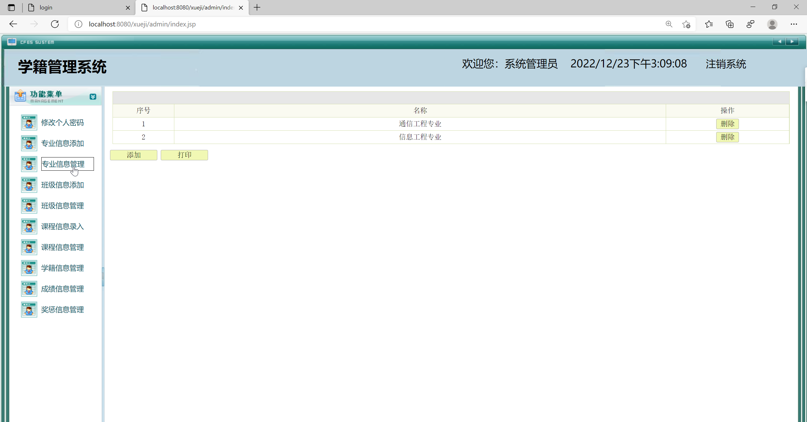
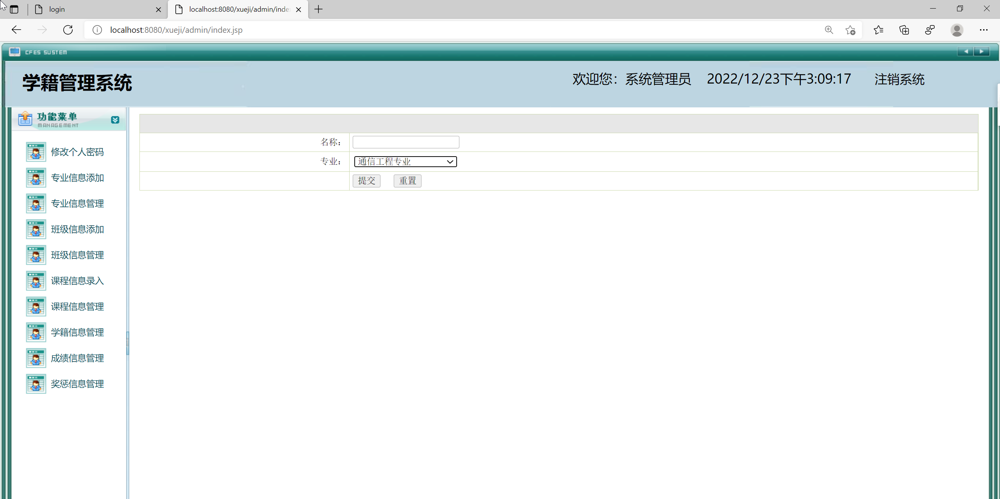
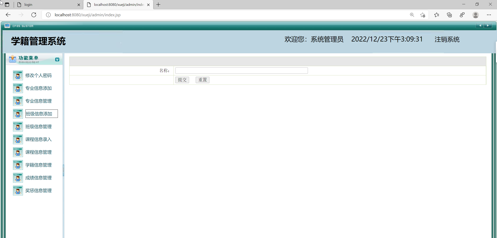
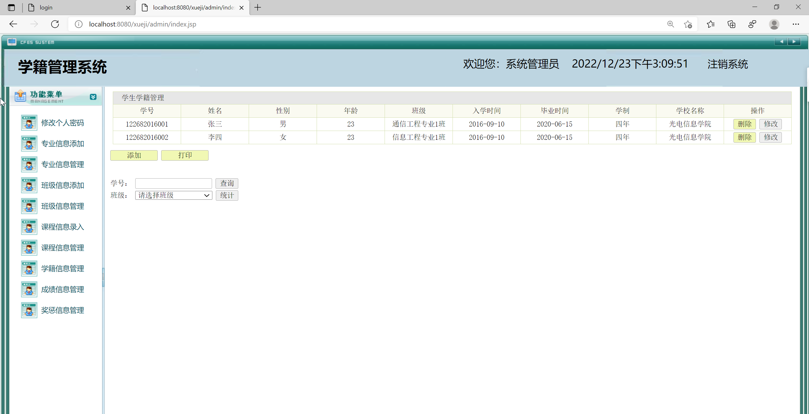
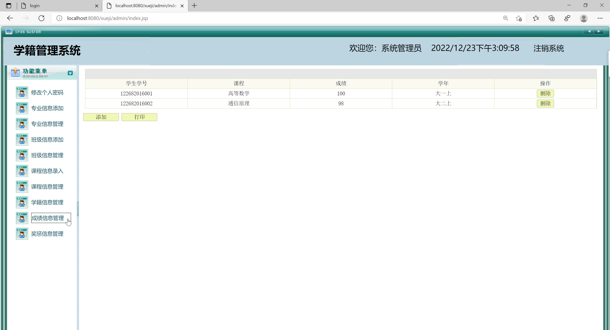
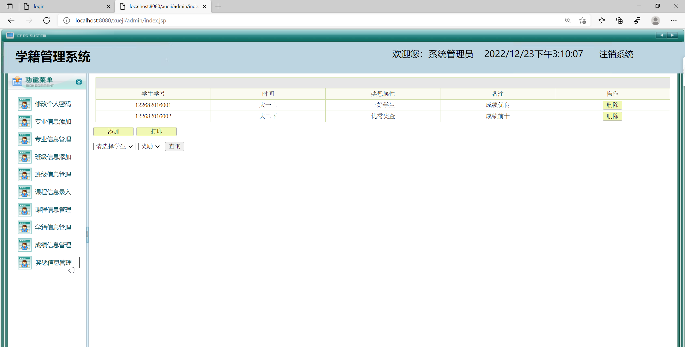

<h1 align="center">基于JSP+Servlet实现的学籍管理系统</h1>

 获取sql文件 QQ: 605739993 QQ群: 377586148 

 [源码获取网站: 从戎源码网](https://armycodes.com/)

## 简介

> 本代码来源于网络,仅供学习参考使用!
>
> 提供1.远程部署/2.修改代码/3.设计文档指导/4.框架代码讲解等服务
>

## 项目介绍

基于JSP+Servlet实现的学籍管理系统，主要功能如下

**【管理员】**
修改个人密码
专业信息添加
专业信息管理
班级信息添加
班级信息管理
课程信息录入
课程信息管理
学籍信息管理
成绩信息管理
奖惩信息管理

## 环境

- <b>IntelliJ IDEA 2020.3</b>

- <b>Mysql 5.7.26</b>

- <b>Tomcat 8.0.32</b>

- <b>JDK 1.8</b>

## 运行截图

